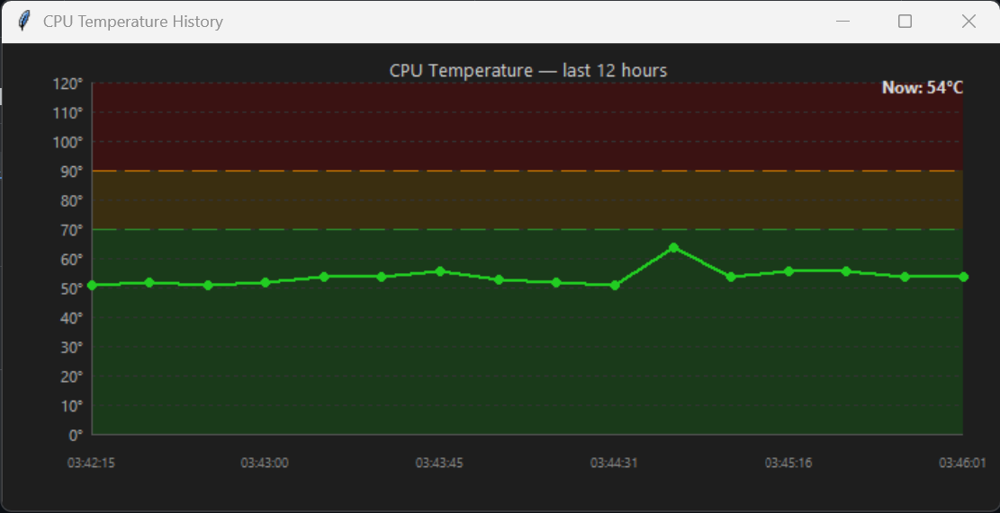

<!-- צג טמפרטורת מעבד -->
# CPU Temp Tray

A lightweight Windows system tray app that displays your CPU temperature as a live colored icon — green, orange, or red based on configurable thresholds.

Powered by [LibreHardwareMonitor](https://github.com/LibreHardwareMonitor/LibreHardwareMonitor) as the sensor backend.



---

## Features

- Live CPU temperature icon in the system tray
- Color-coded: green / orange / red based on your thresholds
- Hover tooltip shows all sensor readings
- Left-click to refresh instantly (with spinner animation)
- Right-click menu: refresh interval presets, history graph, settings, about
- Temperature history graph — last 12 hours, color-coded, persisted across restarts
- Alert popup when temperature enters the red zone (with "don't show again")
- Fully configurable: sensor, thresholds, refresh interval, icon size, font size
- Settings persist across restarts

## Requirements

- Windows 10 / 11
- Python 3.10+
- [LibreHardwareMonitor](https://github.com/LibreHardwareMonitor/LibreHardwareMonitor/releases) — must be running as Administrator with **Remote Web Server enabled** (Options → Remote Web Server → Run)

## Installation

```bash
git clone https://github.com/MeirYaakovi/cpu-temp-tray.git
cd cpu-temp-tray
pip install -r requirements.txt
```

## Usage

1. Launch LibreHardwareMonitor as Administrator
2. Enable its web server: **Options → Remote Web Server → Run**
3. Run the tray app:

```bash
pythonw cpu_temp_tray.py
```

Or double-click `run.bat` (launches LHM + the tray app together).

### Auto-start on boot

Run `add_to_startup.bat` once to register both LHM and the tray app as scheduled tasks that launch silently at logon.

## Configuration

Left-click the tray icon → **Settings**

| Setting | Description |
|---|---|
| Sensor | Which temperature reading to display |
| Green / Orange thresholds | Color breakpoints in °C |
| Refresh interval | How often to poll (5–3600 sec) |
| Icon / Font size | Visual size of the tray icon |
| Red alert | Toggle the popup warning |

## Changelog

### v1.1.0
- **New:** Temperature history graph — right-click the tray icon → History to view the last 12 hours
- **New:** History persists across restarts (`history.json` is saved on every reading)
- **Fix:** Settings fields were blank when another window had been opened first

### v1.0.0
- Initial release

## Third-party licenses

See [`licenses/THIRD_PARTY_LICENSES.md`](licenses/THIRD_PARTY_LICENSES.md).

## License

MIT — see [`LICENSE`](LICENSE).
